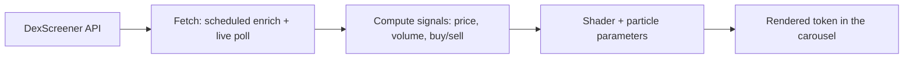
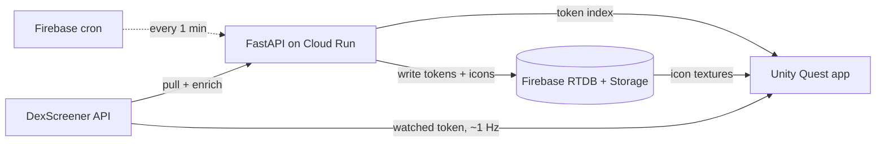

# MetaTokens

A Meta Quest app that turns the live Solana token market into a 3D scene you reach out and sort with your hands. Internal name: coinpump.

## Why I built it

Reading a token's momentum off a table of numbers is slow, and a wall of charts in a headset is worse. I wanted the market to be something you feel. Tokens floating in front of you, where price, volume, and buy/sell pressure show up as motion and color before you read a single figure. This was my main prototype during XR Bootcamp.

## What it does

- Pulls live Solana tokens (price, 6h volume, 6h transactions, price change) from the DexScreener API
- Renders each token as a 3D object in a hand-driven carousel on Quest
- Drag left or right with your hand to scroll through the set; the token in the center slot becomes the "watched" one and updates live
- Maps the data onto the object itself: volume drives an orbiting particle system, price direction tints the body and particles red or green, and the buy/sell ratio drives a ring shader
- Downloads and shows each token's icon on the object face

## How it works

Market data makes a full trip from an API to a token you can grab in VR. It gets fetched, reduced to a few market signals, and those signals drive the shader and particle parameters that render each token.



**The polling split.** The retrieval side runs on two tiers: a shared cloud index the headset reads once, and a direct live poll for the one token you are watching.



A Firebase Cloud Function pings the FastAPI service once a minute. The service pulls the latest Solana token profiles. For each new one it makes a second DexScreener call for the financials, grabs the icon, transcodes it from WebP to PNG, and drops it in Firebase Storage. The index is capped at 250 tokens and evicts anything older than 24 hours, so it stays small. The Quest app loads that whole index once from `/getTokensIndex` and builds the carousel. After that, only the centered token costs anything: `APIManager` polls DexScreener directly at about 1 Hz for its price, volume, and transaction balance. Everything else is only as fresh as the last cron run.

**The visual encoding.** The Unity work I cared about is in `TokenManager.cs`, where the numbers turn into geometry. Each market signal drives one visual channel:

| Market signal | Transform | Visual result |
|---|---|---|
| 6h volume | log10 scale | particle rate, speed, size |
| price change | sign and magnitude | body color and material |
| buy/sell ratio | `_BuyRatio` uniform | ring shader intensity |

Volume is clamped to a 1 to 5,000,000 range before the log10 step, and it also sets the particles' orbital velocity, so a busy token churns while a dead one barely moves. Price change picks the color, and past a few thresholds it swaps the body material from deep red through vivid green. It is a pile of hand-tuned lerps, dialed so the mapping reads at a glance in VR.

**Focus by carousel slot.** The carousel shows five tokens. `SetObjectTransparency` fades each one by its slot: the center stays fully opaque, its neighbors sit at half alpha, and the outer two drop to a fifth. The result reads like depth of field, pulling your eye to the watched token. Scrolling is hand-driven too, with `CoinDisplayManager` following the tracked hand's pointer and shifting the ring once a horizontal drag passes a small threshold.

## Tech stack

- XR: Unity 2022.3.20f1, URP, Meta XR SDK 71 (hand tracking via OVRHand, hand-grab interactables)
- Backend: Python, FastAPI, httpx, Pillow (WebP to PNG), deployed on Cloud Run (Docker + gunicorn)
- Data: Firebase Realtime Database + Storage, with a scheduled Firebase Cloud Function as the cron
- Source: DexScreener public API

## Layout

```
metatokens/
  unity/      Quest app (coinpump_01_coinvisualizer): carousel, token visuals, DexScreener client
  backend/    FastAPI service + Firebase Cloud Function that keep the token index fresh
```

The `project2_3DNFTS` branch holds a second XR Bootcamp prototype: speak a prompt, and it chains Leonardo AI (image generation) and Meshy (image to 3D) to spawn a 3D asset from your voice.

## Running it

Backend:

```bash
cd backend
pip install -r requirements.txt
uvicorn main:app --reload   # or gunicorn, see Procfile
```

You need a Firebase project and a `firebase_key.json` service-account credential in `backend/`, plus your own Firebase config values. The Cloud Function under `backend/functions` deploys with `firebase deploy --only functions`. It calls the deployed service URL on a schedule.

Unity: open `unity/` in Unity 2022.3.20f1 and build to a Quest headset. Hand tracking is required.

## Status

A course prototype from XR Bootcamp. It is no longer maintained, and the token data only means anything while the backend is deployed and the cron is running. The visual encoding is the part I put the most into, and it lives in `unity/Assets/Script/TokenManager.cs`.
