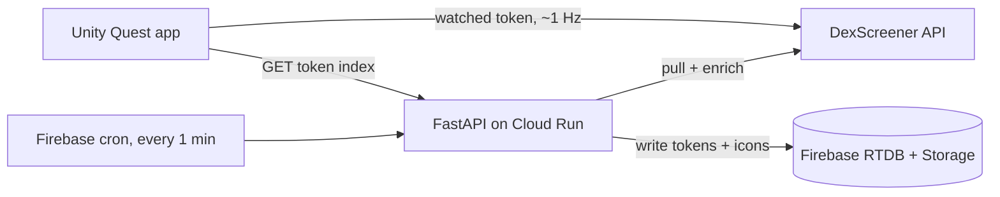

# MetaTokens

A Meta Quest app that turns the live Solana token market into a 3D scene you reach out and sort with your hands. Internal name: coinpump.

## Why I built it

Reading a token's momentum off a table of numbers is slow, and a wall of charts is worse in a headset. I wanted the market to be something you feel spatially: tokens you can grab out of the air, where price, volume, and buy/sell pressure are things you see moving before you read a single figure. This was my main prototype during XR Bootcamp.

## What it does

- Pulls live Solana tokens (price, 6h volume, 6h transactions, price change) from the DexScreener API
- Renders each token as a 3D object in a hand-driven carousel on Quest
- Drag left or right with your hand to scroll through the set; the token in the center slot becomes the "watched" one and updates live
- Maps the data onto the object instead of a label: volume drives an orbiting particle system, price direction tints the body and particles red or green, and the buy/sell ratio drives a ring shader
- Downloads and shows each token's icon on the object face

## How it works

The data path is split in two on purpose. A scheduled job keeps a shared, bounded index warm in the cloud; the headset reads that once, then polls only the token you are actually looking at.



**The polling split.** A Firebase Cloud Function pings the FastAPI service every minute. The service pulls the latest Solana token profiles, and for each new one makes a second DexScreener call for the pair financials, then downloads the icon, transcodes it from WebP to PNG, and stores it in Firebase Storage. The index is capped at 250 tokens and evicts anything older than 24 hours, so it stays cheap and bounded. The Quest app loads that whole index once from `/getTokensIndex`, spawns the carousel, and from then on only the centered token pays for freshness: `APIManager` polls DexScreener directly at roughly 1 Hz for its price, volume, and transaction balance. The tradeoff is that non-focused tokens are only as fresh as the last cron run rather than real-time, which is fine because you are reading one at a time.

**The visual encoding.** The interesting Unity work is in `TokenManager.cs`, where the numbers become geometry. Volume is normalized on a log10 scale (clamped 1 to 5,000,000) and drives particle emission rate, speed, size, and orbital velocity, so a high-volume token visibly churns and a dead one barely moves. Price change picks the color and, past thresholds, swaps the body material (deep red through vivid green). The buy/sell balance is fed to a custom ring shader as a single `_BuyRatio` float. It is a lot of hand-tuned lerps rather than anything clever, but that tuning is the whole point: the mapping has to read at a glance in VR, not be technically faithful.

## Tech stack

- XR: Unity 2022.3.20f1, URP, Meta XR SDK 71 (hand tracking via OVRHand, hand-grab interactables)
- Backend: Python, FastAPI, httpx, Pillow (WebP to PNG), deployed on Cloud Run (Docker + gunicorn)
- Data: Firebase Realtime Database + Storage, with a scheduled Firebase Cloud Function as the cron
- Source: DexScreener public API

## Layout

```
metatokens/
  unity/      Quest app (coinpump_01_coinvisualizer): carousel, token visuals, DexScreener client
  backend/    FastAPI service + Firebase Cloud Function that keep the token index fresh
```

Branch `project2_3DNFTS` keeps a second course prototype from the same period: a voice-driven experiment that chains Leonardo AI (image generation) and Meshy (image to 3D) to spawn 3D assets from a spoken prompt.

## Running it

Backend:

```bash
cd backend
pip install -r requirements.txt
uvicorn main:app --reload   # or gunicorn, see Procfile
```

You need a Firebase project and a `firebase_key.json` service-account credential in `backend/`, plus your own Firebase config values. The Cloud Function under `backend/functions` deploys with `firebase deploy --only functions` and calls the deployed service URL on a schedule.

Unity: open `unity/` in Unity 2022.3.20f1 and build to a Quest headset (hand tracking required).

## Status

Course prototype, not maintained. The token data is only meaningful while the backend is deployed and the cron is running. The visual encoding is the part I cared most about, and it lives in `unity/Assets/Script/TokenManager.cs`.
